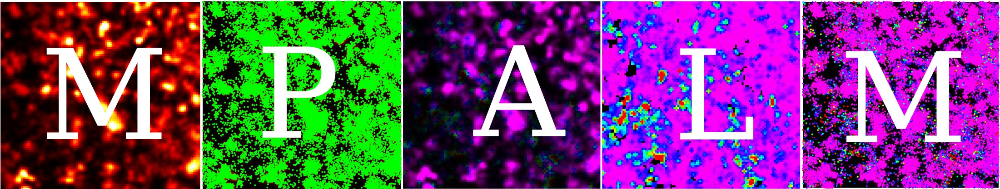

# SMLDM 

Single Molecule Localization and Diffusivity Microscopy

# Installation

SMLDM has the following depencies:

Python 3.10

Fiji distribution of ImageJ

MATLAB 2021 or higher version with the below add-ons installed (additional liscences may required):
1) Image Processing Toolbox
2) Statistics and Machine Learning Toolbox
3) Parallel Computing Toolbox
4) Curve Fitting Toolbox

Hardware requirement: NVIDIA GPU supporting CUDA 11.7, we use NVIDIA Quadro P4000.
| **Component** | **Minimum Requirement**       | **Recommended**                   |
|---------------|-------------------------------|-----------------------------------|
| CPU RAM       | 8 GB                          | 16 GB or more                     |
| GPU VRAM      | 8 GB supporting CUDA 11.7     | 8 GB                              |

### Setting up a conda environment

We recommend create a new conda environment with Python version 3.10. After activating the conda environment, cd to the directory created from the Github clone command, and use below command to install the dependent packages from requirements.txt.

```bash
pip install -r requirements.txt
```

### Setting Up CUDA Environment Path

Please download the CUDA Toolkit (11.7) from Nvidia website https://developer.nvidia.com/cuda-11-7-0-download-archive and install it in your system according to the website instruction.

To enable PyTorch to run on the GPU, you need to add the CUDA toolkit to the system environment path. In linux system, follow these steps to create activate and deactivate scripts for managing the CUDA environment variables:

1. **Create the Activation Script**
   - Create the directory for activation scripts:
     ```bash
     mkdir -p $CONDA_PREFIX/etc/conda/activate.d
     ```
   - Create a file named `env_vars.sh` in the activation directory with the following content:
     ```bash
     #!/bin/sh
     # Environment variable for CUDA 11.7
     export PATH=/usr/local/cuda-11.7/bin${PATH:+:${PATH}}
     export LD_LIBRARY_PATH=/usr/local/cuda-11.7/lib64${LD_LIBRARY_PATH:+:${LD_LIBRARY_PATH}}
     ```

2. **Create the Deactivation Script**
   - Create the directory for deactivation scripts:
     ```bash
     mkdir -p $CONDA_PREFIX/etc/conda/deactivate.d
     ```
   - Create a file named `env_vars.sh` in the deactivation directory with the following content:
     ```bash
     #!/bin/sh
     # Unset environment variable for CUDA 11.7
     export PATH=${PATH#/usr/local/cuda-11.7/bin:}
     unset LD_LIBRARY_PATH
     ```

These scripts will automatically set and unset the CUDA environment variables when you activate and deactivate your conda environment, respectively.

### Setting up wandb account for logging training progress (optional)
Set up an account at [Weights & Biases](https://wandb.ai/site/), and follow the [Quick Start guide](https://docs.wandb.ai/quickstart) to configure your wandb account in the activated conda environment.
We strongly recommend to use wandb to log the training progress, otherwise you need to delete all `-do_log` option in below training script.

# Train your own models

You can download our provided the pretrained U-Net model (`checkpoint_UNet_epoch20.pth`) and the pretrained Deep-SnapTrack model (`MBX_20231220_110nmPix_rep2_epoch9.pth`) from the zenodo repository https://zenodo.org/records/15089354. Please note that these models are trained under specific camera setups (camera pixel size 110 nm) and experimental conditions (exposure time 30 ms). Depending on your own setup and data, you recommend measure your microscopic point-spread-function using the fluorescent beads and generate simulated training dataset as explained below, and to retrain these models to achieve optimal performance for your application. 

## Step 1: simSnapshot

We developed a pipeline to convert the simulated Brownian diffusing trajectories into simulated molecule snapshot images together with its mask and track image as datasets for downstream model training. The molecule trajectories were generated using a pubished method called simSPT ([Tjian - Darzacq lab / simSPT · GitLab](https://gitlab.com/tjian-darzacq-lab/simSPT)). We generated a set of trajectories with logarithmically increasing diffusion coefficients using the command recorded in `simSPT_script.txt`. For convenience, we simulated long tracks with 1-ms time interval and segmented them into shorter segments matching the desired exposure time. 

Notably, we modified the `betaUnit` parameter in the original `simSPT.c` file from 0 to 1 to count track lifetime in seconds to generate long tracks. We also modified the `gaps` parameters in the original `simSPT.c` file from 1 to 0 to avoid gaps in tracks.

We provided our simulated molecule trajectories under the zenodo repository https://zenodo.org/records/15233247.

Next, we generated training datasets for the U-Net segmentation model. First, we placed four molecule trajectories into a single 32×32 image with a pixel size of 110 nm. The positions of the molecule trajectories were convolved with a Gaussian model of the microscopic point-spread function (PSF). The resulting matrix was then binned, rescaled to the desired signal-to-noise ratio (SNR), and augmented with both Gaussian white noise and Poisson shot noise to mimic experimental molecule snapshots. The mask for each molecule was defined as the region encompassing the top 95% of the total intensity signal. The simulated snapshot and corresponding mask images were paired to serve as the ground truth for U-Net training. This process can be executed using the following script:

`step0_sim_4molecules_forUNet.m`

To generate training data pairs for Deep-SnapTrack, we placed a single molecule trajectory into a 32×32 image with a pixel size of 110 nm and generated its snapshot image using the method described above. The molecule trajectories were then convolved with a 7×7 Gaussian kernel (σ = 1 pixel-width), and this convolution was evaluated at an 11-nm pixel width to produce a higher-resolution 320×320 track image. The final training dataset for Deep-SnapTrack consisted of paired simulated snapshot images and their corresponding track images. This process can be executed using the following script:

`step0_sim_1molecule_forDeepSnapTrack.m`

## Step 2: U-Net training

After preparing single molecule snapshot images and corresponding masks according to **Step 0: Sim Snapshot**. Specify your path to data pairs in `step1-0_train_multiGPU.sh` by defining:

```
--dir_img  /path/to/save/simulated_dataset_forUNet/images/ \
--dir_mask  /path/to/save/simulated_dataset_forUNet/masks/ \
```

And define a data path where you save your checkpoint files:

```
--dir_checkpoint ./checkpoints/ \
```

Run the `.sh` file to generate customized U-Net models.

We provide scripts for two mode of training, either training with a single GPU or training with multiple GPUs using torchrun.

## Step 3.1: Deep-SnapTrack training

In order to train Deep-SnapTrack with your own data, you need to prepare simulated single molecule snapshot images and corresponding ground truth trajectory maps. Specify your path to data pairs in `step3-0_ptorch_train.sh` by defining:

```
--dir_img  /path/to/save/simulated_dataset_forDeepSnapTrack/imgs \
--dir_mask  /path/to/save/simulated_dataset_forDeepSnapTrack/trackHeatmap \
```

And define a data path where you save your checkpoint files:

```
--dir_checkpoint ./checkpoints/ \
```

Run the `.sh` file to generate customized Deep-SnapTrack models.

We provide scripts for two mode of training, either training with a single GPU or training with multiple GPUs using torchrun.

## Step 3.2: Set Calibration Curve Between PT-area and Diffusivity
To establish a calibration curve that relates PT area to molecule diffusivity, we must first obtain the simulated snapshot images with known ground-truth diffusivity. To do this, run the `step0_sim_1molecule_Calibrate.m` script from the `step0_simSnapshot` directory, setting the high signal-to-noise ratio (SNR) range to [35 35], since we have demonstrated that the calibration curve is robust under various SNR levels.

Next, run the `Gauss2D_calibration.ipynb` script from the `step0_simSnapshot` directory to predict the PT-area for the simulated snapshot images. Be sure to use the trained model weight from step 3.1. The results will be saved in a comma-separated values (CSV) file containing the ground-truth diffusivity and predicted PT-area for each simulated snapshot image.

Then, read the csv and fit using the equation `y = coeff_a*sqrt(x)`, where y is PT-area, and x is D_value, and obtain the fitting constant `coeff_a`.


# SMLDM data analysis

We will use one ND2 image captured for Paxillin-Halo as the example to demonstrate the analysis pipeline. You can download this image file from the the zenodo repository https://zenodo.org/records/15089354.

Before start, you need to place the raw image `20240712_Clust01_U2OS_Paxillin_30p5ms_2kframe_001.nd2` under the path `/path/to/your/Paxillin_raw_data`, and create a folder `Paxillin_results` under the path `/path/to/save` to save the result files.

## Step 1: U-Net Segmentation

To do segmentation with U-Net, specify your data path in the corresponding section of `step1-1_ND2batch_prediction.sh`:

    --model /path/to/your/model/checkpoint_UNet_epoch20.pth \
    --input /path/to/your/Paxillin_raw_data/20240712_Clust01_U2OS_Paxillin_30p5ms_2kframe_001.nd2 \
    --output /path/to/save/Paxillin_results/

 The output will be a `.tif` file corresponding to your raw data named `UNet_mask_MBX_20240620_epoch20_Ch1.tif`

## Step 2: Single Molecule Selection

### Do ThunderSTORM Localizations

We use ThunderSTORM (https://github.com/zitmen/thunderstorm) to assist in selecting qualified snapshot from U-Net result, i.e. only one ThunderSTORM localization in a U-Net mask is kept as single-molecule snapshot for downstream analysis. To do this, please first install [ThunderSTORM](zitmen.github.io/thunderstorm/) plugin in your ImageJ. Then, modify the input and output folder path in `step2-1_IJmacro_ThunderSTORM.ijm`. Edit the line 30 if you want to include more filter string to filter your image files. The script will first create a new folder "ThunderSTORM" under the root result path `Paxillin_results`, the localization files from ThunderSTORM will be saved there.

```
input_dirs = newArray(
	"/path/to/your/Paxillin_raw_data/"
);
output_dirs = newArray(
	"/path/to/save/Paxillin_results/ThunderSTORM/"
);
```
After finish the ThunderSTORM step, move to `step2-2_script_snapshot_detection.m` to use ThunderSTORM localization filter the qualified single-molecule snapshots.

### Select Qualified Snapshots

If your data was generated with bulk images captured after each illumination sequence, for example after every 2000 frames, you can set `has_bulk_image` true and manually select an ROI. Otherwise you can set `draw_fullROI` true and no masks will be eliminated in this step.

```matlab
% >>>>>>>>>>>>>>>>>>>> NUCLEUS SELECTION >>>>>>>>>>>>>>> %
has_bulk_imgs = false;
skip_drawROI = false; % set true if already done
draw_fullROI = true;
WideField_subfolder = 'BF';
% <<<<<<<<<<<<<<<<<<<< NUCLEUS SELECTION <<<<<<<<<<<<<<< %
```

Next, specify your data path:

```matlab
% >>>>>>>>>>>>>>>>>>>> MOTION BLUR DETECTION PARAMETERS >>>>>>>>>>>>>>>>>>>> %
% The parent folder for raw images
input_path = '/path/to/your/Paxillin_raw_data/';

% The parent folder for saving analysis results
output_path = '/path/to/save/Paxillin_results/';

% Unique identifier for each ND2 image sequence, result from same sequence will be saved in the same folder
input_rawND2_prefix = {...
    '20240712_Clust01_U2OS_Paxillin',
     };
% <<<<<<<<<<<<<<<<<<<< MOTION BLUR DETECTION PARAMETERS <<<<<<<<<<<<<<<<<<<<< %
```

After finishing these settings, run `step2-2_script_snapshot_detection.m`. The output will be a file named `Blurdata_UNet_mask_MBX_20240620_epoch20_Ch1.mat`. Note that all names have to be defined in `input_rawND2_prefix` if your raw data contains multiple image sequence files.

## Step 3: Deep-SnapTrack

To do prediction with Deep-SnapTrack, specify the data path in the corresponding section of `step3-1_batch_prediction.py`

```python
# >>>>>>>>>>>>>>>>>>>>>>>>>> input >>>>>>>>>>>>>>>>>>>>>>>>>> #
# directory of your DeepSnapTrack model
weights_file = './checkpoints/MBX_20231220_110nmPix_rep2_epoch9.pth'

# parent directory where you save U-Net motion blur extracted mat folder
rootDir = '/path/to/save/Paxillin_results'

# directory of U-Net motion blur extracted mat folder
dataDir = [   
    '20240712_Clust01_U2OS_Paxillin_Cell01',
    ]

UNet_model = 'UNet_mask_MBX_20240620_epoch20_Ch1' # Indentifier for the UNet model
blurmat_file_prefix = 'Blurdata_'+UNet_model # File name prefix that record UNet extracted snapshot
fitresult_file = 'Fitresult_'+UNet_model+'.csv' # File name that record elliptical Gaussian fitting result
sr_fileName = UNet_model+'_SR_pred_v3.csv' # File name that record all MPALM result
coeff_a = 1162.0 # Replace with your fitting constant from step 3.2 to convert PT-area to diffusivity, for our model and experimental settings, coeff_a = 1162

# raw image files, keep order same as dataDir
ND2File = [    
    '/path/to/your/Paxillin_raw_data/20240712_Clust01_U2OS_Paxillin_30p5ms_2kframe_001.nd2',
    ]

# <<<<<<<<<<<<<<<<<<<<<<<<<<<< input <<<<<<<<<<<<<<<<<<<<<<<<<<<< #
```

Then run the following command to generate final results

```
python step3-1_batch_prediction.py
```

The output will be a CSV file named `UNet_mask_MBX_20240620_epoch20_Ch1_SR_pred_v3.csv`, saved in your input `dataDir`, along with your previously generated MAT file named `Blurdata_UNet_mask_MBX_20240620_epoch20_Ch1.mat`.

The csv file contains:

| Column            | Description                                                                 | Unit                     |
|-----------------|-----------------------------------------------------------------------------|--------------------------|
| Frame           | Frame number                                                                | -                       |
| PSF_idx         | Index of snapshot                                                           | -                       |
| Xpos            | X coordinate of molecule                                 | Image pixel              |
| Ypos            | Y coordinate of molecule                                 | Image pixel              |
| TotalPhoton     | Estimated total photon number (unit: photons)                               | Photons                  |
| Intensity       | Intensity value from elliptical Gaussian fitting                | a.u.                     |
| Background      | Background value from elliptical Gaussian fitting                | a.u.                     |
| EllipticityIdx  | Ellipticity index (no longer used, please ignore)                            | -                       |
| Angle           | Angle of ellipticity (no longer used, please ignore)                        | -                       |
| SNR             | Signal-to-noise ratio                                       | Decibel                  |
| COV             | Covariance (another measurement for SNR)                                    | -                       |
| UNetArea        | Molecule snapshot area from U-Net masks                   | Image pixel              |
| SRArea          | Molecule pseudo-track area, can convert to diffusion coeffcient                     | 1/10 of image pixel      |
| D          | Molecule diffusion coefficient                      | um^2/s      |

The mat file contains:
| Variable Name       | Description                                                                 | Variable Type |
|---------------------|-----------------------------------------------------------------------------|---------------|
| UNet_model_folder   | Path of U-Net masks                                                         | cell          |
| cell_PSF            | Stores the pixel coordinate and pixel intensity of detected snapshots       | struct        |
| filter              | Filter parameters defined in step2-2_script_snapshot_detection.m          | struct        |
| impars              | Image acquisition parameters defined in step2-2_script_snapshot_detection.m | struct        |
| input_path          | Raw image path                                                              | char          |
| input_rawND2_prefix | The prefix of image used for naming files                                   | char          |
| output_path         | Path to save result                                                         | char          |

### File path tree after step 1-3
After running step 1-3, you should get a file path tree like below:
```text
Paxillin_raw_data/
└── 20240712_Clust01_U2OS_Paxillin_30p5ms_2kframe_001.nd2
Paxillin_results/
├── 20240712_Clust01_U2OS_Paxillin_30p5ms_2kframe_001/
│   └── UNet_mask_MBX_20240620_epoch20_Ch1.tif
├── 20240712_Clust01_U2OS_Paxillin_Cell01/
│   ├── Blurdata_UNet_mask_MBX_20240620_epoch20_Ch1_Slice01.mat
│   ├── Fitresult_UNet_mask_MBX_20240620_epoch20_Ch1.csv
│   └── UNet_mask_MBX_20240620_epoch20_Ch1_SR_pred_v3.csv
├── roi_files/
│   └── 20240712_Clust01_U2OS_Paxillin_roi_metadata.mat
└── ThunderSTORM/
    ├── 20240712_Clust01_U2OS_Paxillin_30p5ms_2kframe_001_C1.csv
    └── 20240712_Clust01_U2OS_Paxillin_30p5ms_2kframe_001_C1-protocol.txt
```

## Step 4: MPALM rendering

 You can get the final visualization result by uploading the two files generated from the last step` UNet_mask_MBX_20240620_epoch20_Ch1_SR_pred_v3.csv`  and `Blurdata_UNet_mask_MBX_20240620_epoch20_Ch1.mat `to the MATLAB app provided under ./step4_MPALM_rendering/step4_main_mobilityPALM.mlapp. For the user guide of this app, please see ./step4_MPALM_rendering/Users Guide.docx.

 ## Common bug fix:
 1. Get error when running step2 after renaming folder to other name \
 Fix: check if there is any temporal file generated under raw image folder, if yes, delete them all.
